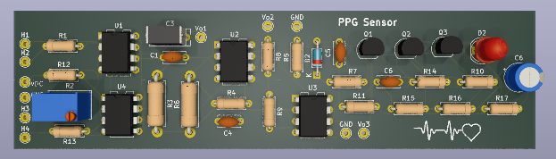
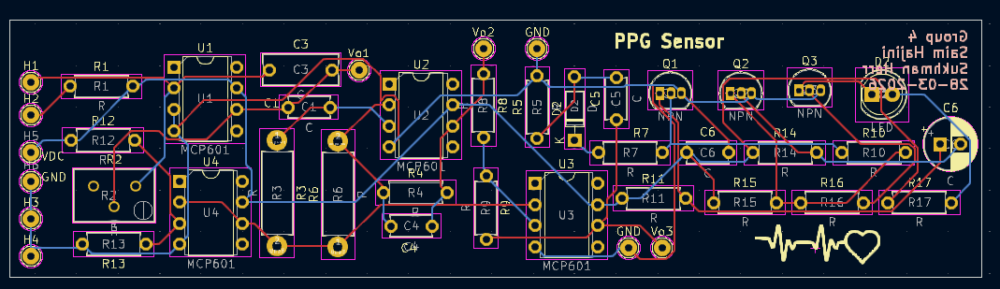
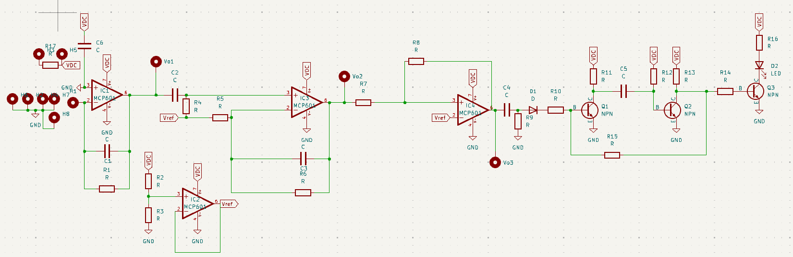
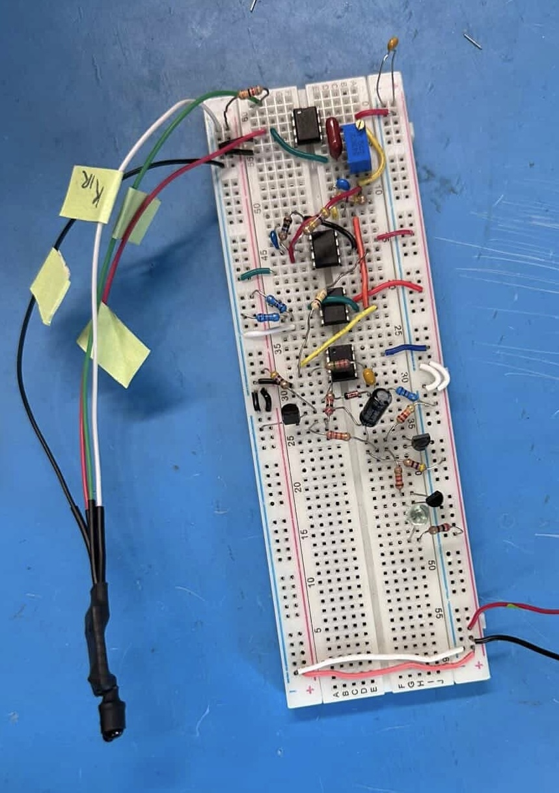

# PPG Heart Sensor PCB

A PPG heart-rate sensor PCB designed in KiCad as a hardware extension of an ENGR 352 Microelectronics II project. The original project was simulated and prototyped on breadboard, and this PCB was created to turn that design into a cleaner final implementation.

## Overview
- KiCad schematic and PCB design
- LTspice simulation
- Breadboard prototype
- PCB fabrication files

## Main Component
- MCP601 op-amp

## Current Status
- Simulation completed
- Breadboard prototype completed
- PCB designed and submitted for fabrication
- Final PCB bring-up pending board arrival

## Images

### 3D Render

### PCB Layout

### Schematic

### Breadboard Prototype

