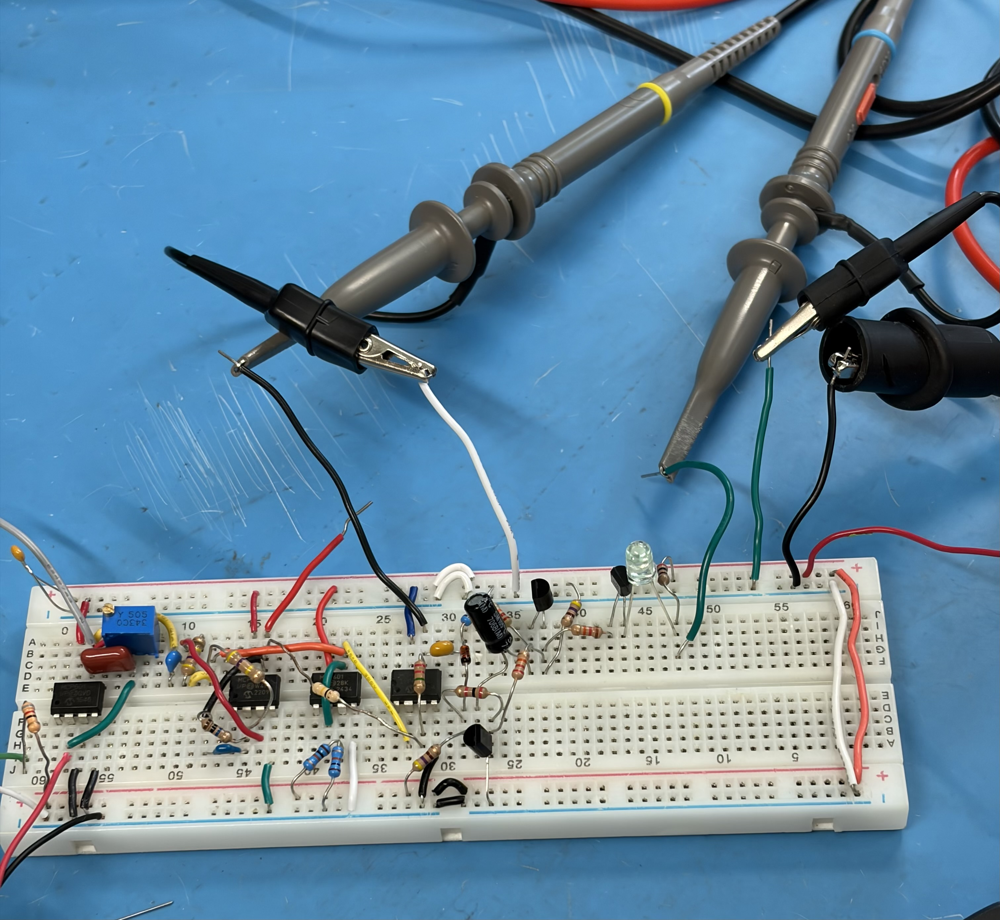

# PPG Heart Sensor PCB

A custom KiCad PCB developed as an extension of a UBC ENGR 352 Microelectronics II photoplethysmography (PPG) heart-rate sensing project. The original course work focused on simulation and breadboard prototyping, and this PCB was designed to turn that work into a cleaner hardware implementation.

## Overview

This project is based on a PPG sensing approach that uses an infrared emitter and photodiode to detect pulse-related changes optically. The original course work focused on simulation and breadboard prototyping, while this repository focuses on the PCB design, supporting simulation files, fabrication outputs, and project visuals.

## Main Component

- MCP601 op-amp

## Repository Contents

- **Hardware/**: KiCad schematic, PCB, project file, and footprint library
- **Simulation/**: LTspice simulation file
- **Fabrication/**: manufacturing package used for PCB ordering
- **Docs/**: schematic image, PCB layout, 3D render, and breadboard prototype photos

## Current Status

- LTspice simulation completed
- Breadboard prototype completed
- PCB designed in KiCad
- Fabrication files generated and submitted
- Final PCB assembly and hardware validation pending board arrival

## Project Images

### 3D Render

### PCB Layout

### Schematic

### Breadboard Prototype

## Notes

This repository documents both the original prototype stage and the PCB design work completed afterward. The PCB was created as an extra step beyond the base lab requirement in order to package the design into a more polished hardware form.

## Tools Used

- KiCad
- LTspice
- Git / GitHub
